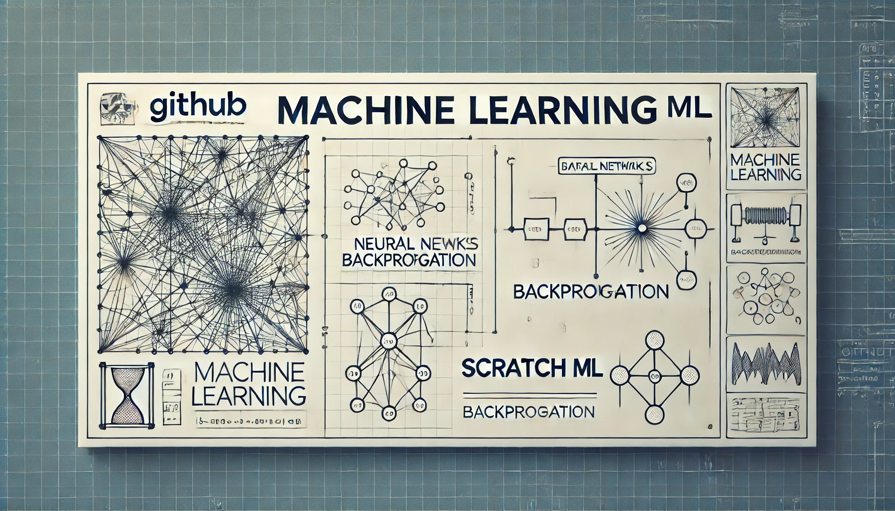

# About
Scratch-ML is a personal project because I was tired of blindly using ML libraries without really getting what was happening under the hood. Instead of treating scikit-learn, PyTorch, and TensorFlow like magic boxes, I decided to rebuild everything from scratch using just NumPy. Each implementation here represents me figuring out how these algorithms actually work, rather than just calling model.fit() and hoping for the best.


# Installation

```bash
# Clone the repository
git clone https://github.com/yourusername/Scratch-ML.git

# Navigate to directory
cd Scratch-ML

# Install dependencies
pip install -e .
